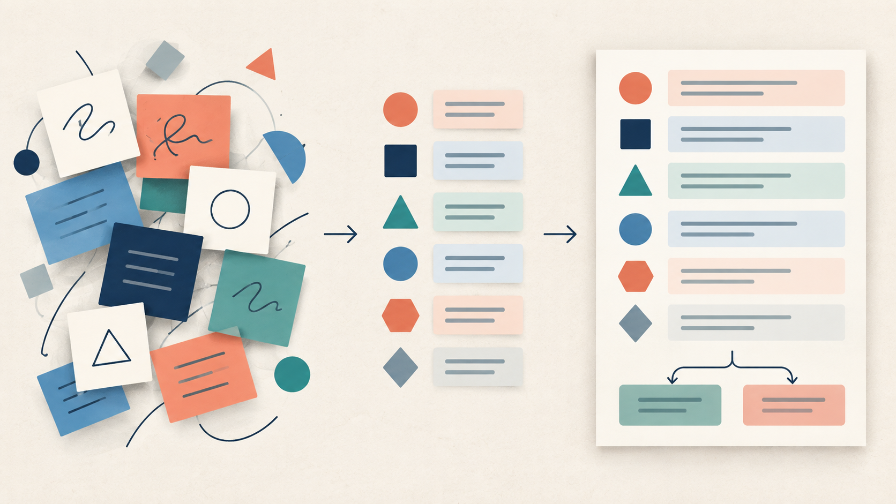
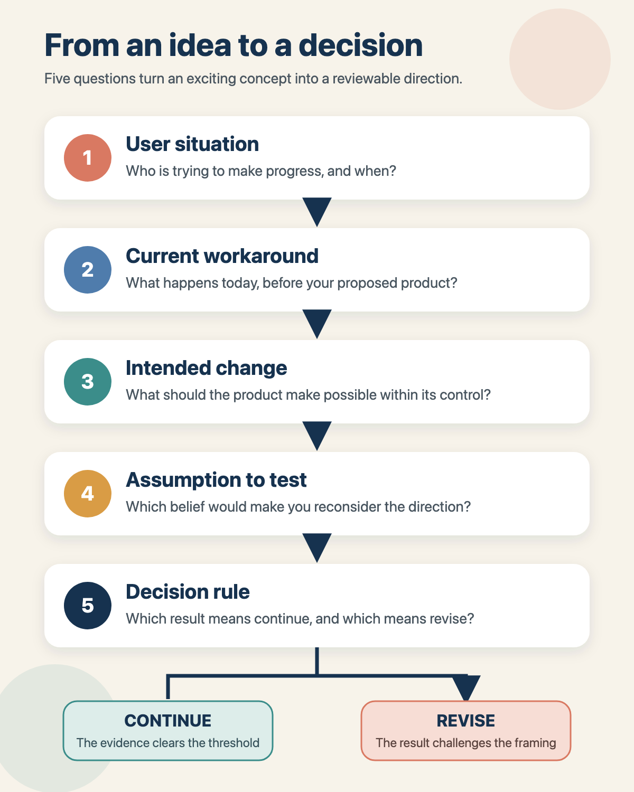
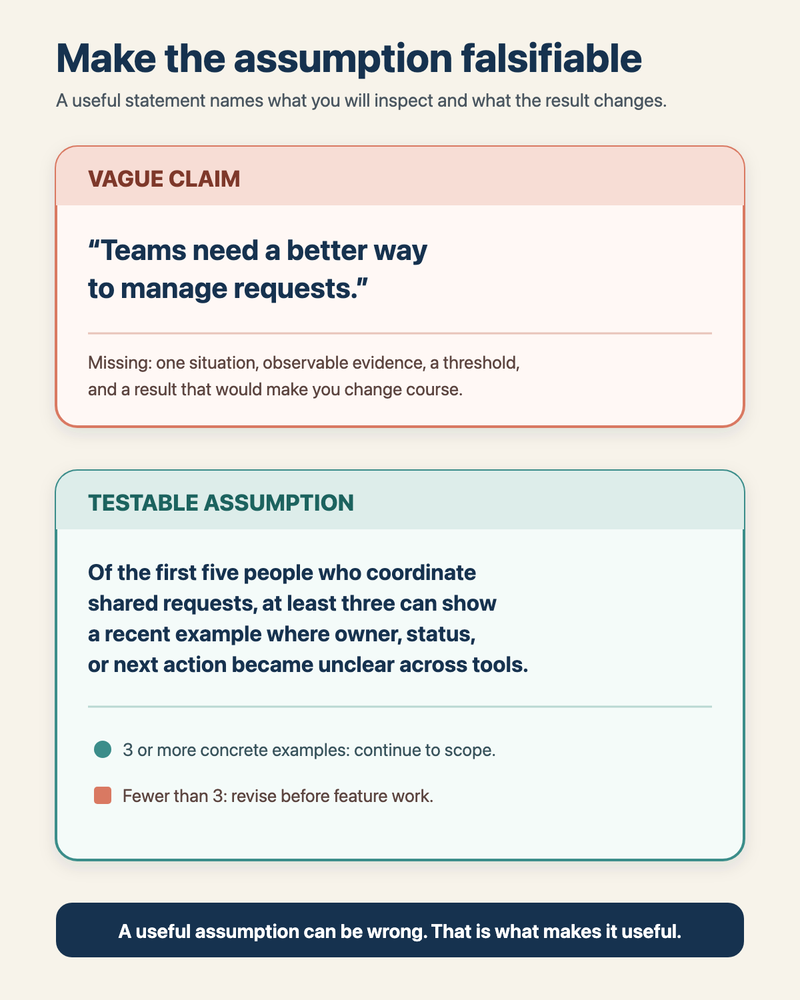
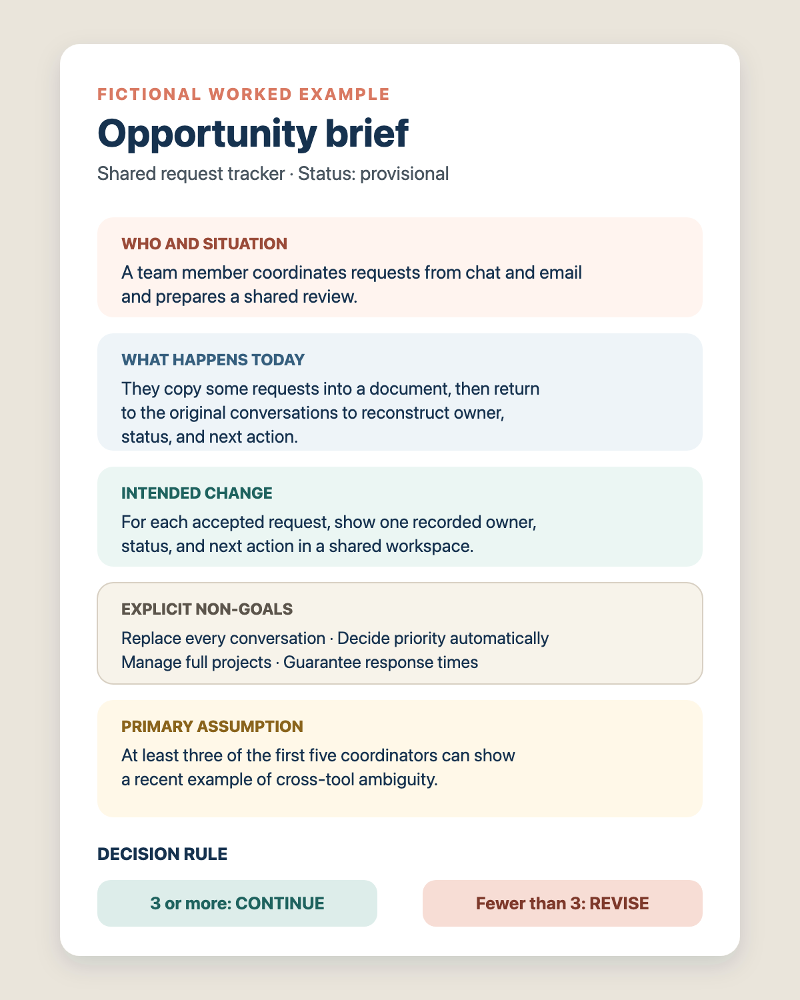

# Start with a problem you can explain

A software idea can feel clear because you can picture the finished product. That picture is useful, but it can hide the most important unanswered question: what problem are you asking someone to change their behavior for?

Before you choose a stack or build a feature list, write a one-page opportunity brief. It should let another person understand who has the problem, what happens today, what change you intend to create, what you are deliberately not solving, and which assumption could prove the direction wrong.

The result is not a miniature product requirements document. It is a decision aid. You should be able to explain it in one minute, revise it when evidence changes, and use it to choose the next learning step.

## Separate the idea, the problem, and the proposed solution

These three statements answer different questions:

- **Idea:** What kind of thing could exist?
- **User problem:** Who is trying to do what, in which situation, and what makes the current way difficult?
- **Proposed solution:** What change might make that situation better?

For example:

- Idea: a shared request tracker.
- User problem: a team member who coordinates incoming requests has to reconstruct ownership and status from several messages and documents.
- Proposed solution: one shared place that shows each request's owner, status, and next action.

The solution may change. The problem statement gives you a stable point to examine before you become attached to one interface or architecture.

A useful problem statement names a situation, not a fictional biography. You rarely need a made-up name, age, personality, or job title. Start with the role that encounters the problem, the moment it appears, and the current workaround. Specificity should come from the work, not invented personal detail.

## When this brief helps

Use the brief when you have an idea or an observed problem but have not yet committed to a stack, product name, or feature backlog. It is especially useful when several plausible solutions are competing for attention.

You can keep the first version very light. If the decision is small and reversible, write six lines: user, situation, current workaround, intended change, non-goals, and the assumption that determines the next step. Expand it only when more people need to review the choice or the consequences become harder to reverse.

You can skip a formal brief for a tiny implementation detail whose user problem and boundaries are already governed by an accepted product decision. Do not skip it merely because the solution feels obvious.

## Write the opportunity in four passes

### 1. Name one user situation

Write about a role you can describe without inventing a persona:

When **[role]** is **[situation]**, they need to **[task or progress]**.

Keep the unit small. "Everyone who manages work" is too broad. "A team member routing a new request while the original conversation is still active" is specific enough to inspect.

If several people participate, state who performs the work and who receives the result. Buyer, operator, and beneficiary may be different people. Do not merge them just to make the sentence shorter.

### 2. Describe what happens today

Ask what the person does without your proposed product. The answer may be a spreadsheet, chat thread, paper note, another product, or simply tolerating the problem.

Describe the sequence and friction without exaggeration:

Requests arrive through chat and email. The coordinator copies some into a shared document, asks for status in the original threads, and reconstructs ownership before each review.

Avoid unsupported outcome language such as "this wastes hours" or "requests always get lost" unless you have measured it. A precise account of the workaround is more useful than a dramatic claim.

Record what supports the statement. Direct observation, an interview, an existing artifact, and your own assumption are different evidence states. Label them honestly.

### 3. State the intended change and the non-goals

The intended change should describe what your product will make possible, not an outcome outside its control:

A team member can see the current owner, status, and next action for each accepted request in one shared workspace.

That is stronger than "the team never misses a request." A tracker can display recorded state. It cannot guarantee that every person records accurate information or follows up on time.

Now add explicit non-goals. Non-goals are not an apology for a small product. They protect the promise from silent expansion.

For the illustrative tracker, non-goals could be:

- replacing every email and chat conversation;
- automatically deciding request priority;
- becoming a full project management suite;
- guaranteeing response times or business outcomes.

If a non-goal later becomes important, revisit the brief deliberately. Do not let it enter through a convenient feature.

### 4. Choose one assumption and a decision rule

An assumption becomes useful when it is falsifiable. Write what you believe, how you could learn whether it is wrong, and what you will do with the result.

Weak:

Teams need a better way to manage requests.

Testable:

Of the first five people who currently coordinate shared requests and review the proposed workflow, at least three can show a recent example where ownership, status, or next action became unclear across tools.

Decision rule:

If at least three can provide a concrete recent example, continue to define the smallest complete request flow. If fewer than three can, pause and revise the user, situation, or problem before scoping features.

The threshold is a planning choice, not a universal standard. Choose one that is cheap enough to use and strong enough to change your decision. The point is to prevent every result from being interpreted as permission to continue.

Your cheapest next learning step should examine the riskiest assumption without building the whole product. It might be a short walkthrough, a review of real artifacts, a paper workflow, or a manual trial. Designing a complete audience-access experiment is a later step. Here, you only need to name what you must learn next and how it affects the decision.

## Illustrative example: a shared request tracker

This example is fictional. It is not a report about a real product or measured users.

**Who and situation:** A team member coordinates requests that arrive through chat and email and prepares a shared review.

**What happens today:** The coordinator copies some requests into a document and checks original conversations to reconstruct owner, status, and next action. Which requests are affected, and how often, are not yet known.

**Intended change:** For every accepted request, a team member can view one recorded owner, status, and next action in a shared workspace.

**Non-goals:** Replace every conversation, prioritize work automatically, manage full projects, or guarantee response times.

**Evidence:** None. The example is invented for teaching.

**Primary assumption:** Among the first five people who coordinate shared requests and review the proposed workflow, at least three can provide a recent example of ownership, status, or next-action ambiguity across tools.

**Cheapest next learning step:** Walk through the brief and a paper request flow with those five people. Ask for a recent artifact or sequence, not agreement with the idea.

**Decision rule:** At least three concrete examples means continue to scope a small end-to-end request flow. Fewer than three means revise the problem framing before feature work.

Notice what the brief does not decide. It does not choose a database, notification system, business model, or final interface. It makes the opportunity understandable enough to decide what deserves learning next.

## Check the brief

Start with whatever triggered the idea: an observation, a request, a recurring workaround, or a concept you want to test. Write the brief from top to bottom. Mark each uncertain statement as an assumption rather than smoothing it into confident prose.

Choose one primary assumption. Give it a learning step and a decision rule with two real branches: continue and revise, pause, or stop. Read the completed brief aloud. A colleague who has not seen your notes should be able to explain the user, current situation, intended change, non-goals, and next decision in about one minute.

If they cannot, shorten or clarify the brief. If they repeat features but cannot state the problem, return to the user situation and workaround. If every possible result leads to building, rewrite the decision rule.

## What this brief proves, and what it does not

A clear opportunity brief proves that the direction is explicit and reviewable. It does not prove demand, usability, technical feasibility, or commercial value. Those need their own evidence.

Revisit the brief when you learn that the user is different, the workaround is tolerable, the intended change is outside your control, or a non-goal has become central. Preserve the old version so you can see which evidence changed the decision.

The next useful step is to find a realistic route to people or artifacts that can test the assumption. Once the problem survives that contact, define the smallest complete experience that can deliver the intended change.

---
