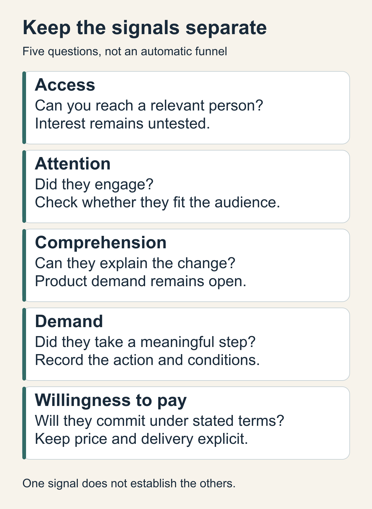
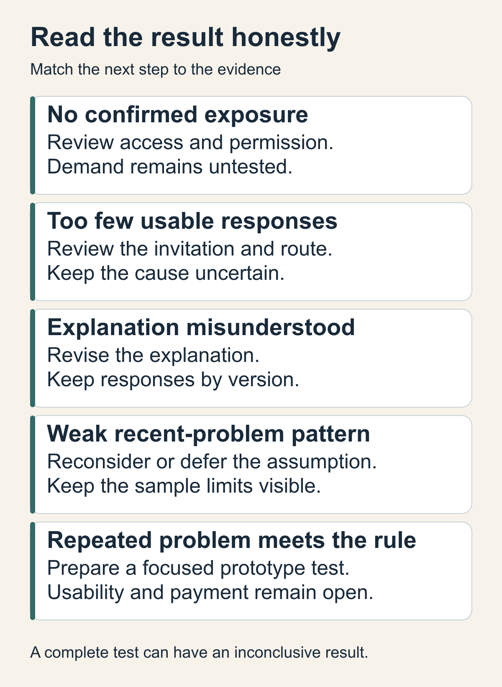

# Find a route to users before building

You can explain the problem and picture a useful product. The next question is whether you can reach someone who actually has that problem and learn something before you commit to a build.

Start with one small discovery test. Choose a reachable audience, one question, something useful to offer, and a limit on how much time you will spend. Decide in advance what different results would mean.

The result is a short experiment brief. It connects your opportunity brief to a real route to people, while keeping access, interest and buying intent separate.

## Start with a situation you can recognize

Bring three inputs: who experiences the problem, the situation in which it occurs, and the assumption you most need to check. If those are still unclear, write a provisional version and label it as a guess.

For example, this chapter uses a **fictional shared request tracker**. Its proposed audience is the person who coordinates incoming requests for a small team. The suspected problem is reconstructing ownership and status from scattered messages, especially when another person takes over.

That description gives you a way to recognize a relevant conversation. Someone who likes productivity software may have useful opinions, but you still need to establish whether they handle this situation. Avoid inventing a detailed persona to make an uncertain audience feel more specific.

Use this method when access to potential users or the importance of the problem is uncertain. If you already work closely with people who experience it, start with a conversation about a recent occurrence. You may not need a landing page, channel comparison or separate recruitment exercise.

## Separate the signals you might observe

A route to people can produce several different kinds of evidence:

- **Access:** an intended reader had a real opportunity to encounter your material, or a relevant person agreed to speak with you.
- **Attention:** they read, watch, click or reply. You still need to know whether they fit the audience.
- **Comprehension:** they can explain the proposed change accurately, in their own words.
- **Demand:** they describe an important problem and take a meaningful step toward trying to solve it. Record that step and its conditions.
- **Willingness to pay:** they make a concrete commitment under stated price and delivery terms. General enthusiasm leaves this question open.

These are questions to keep separate, not a funnel every person must complete in order. A helpful conversation might establish a recent problem without testing your product explanation. A signup might show interest without establishing willingness to pay.

Choose the signal your test can reasonably produce. For an early problem interview, recent behavior and current workarounds are more useful than a promise to use something that does not exist yet.

## Choose one route you can actually use

Compare a few routes against your audience and capacity. Write down the access you have, the permission you need, the material you would create, and the time needed to handle replies.

- **Introductions:** a person you know may be able to introduce you to someone in the relevant role. This can give you a focused conversation, but you must confirm that an introduction is available and welcome.
- **An existing community:** members may discuss the situation regularly. Read its current rules and ask the organizer where needed. A large membership count does not tell you whether your intended people will see a particular post.
- **A useful article or public resource:** this can help people without asking for a meeting. It still needs a route to discovery. Putting a page online establishes a destination; reaching relevant readers remains another question.

For the fictional tracker, choose introductions to people who coordinate team requests as the primary route. Keep one alternative: a relevant operations community that permits research requests. That alternative is a proposal to check, not an assumed source of participants.

Record why the primary route fits now. Perhaps an available introduction can answer your problem question with less preparation than a public campaign. If no route is available, make access the first question to test. Do not build a website solely to make the plan look complete.

## Offer something useful and ask about recent behavior

A small artifact can give someone a reason to engage without requiring a signup. For the tracker, offer a short request-handoff checklist: what the request is, who owns it, its current status and the next action. It should be useful even if your product never ships.

Keep the initial invitation specific. In the fictional example, it could read:

**Illustrative invitation:** "I am exploring how small teams hand over incoming requests. If you coordinate that work, would you be open to a ten-minute conversation about a recent handoff? I can also share a short checklist. There is no product to sign up for."

During the conversation, ask about the person's existing process before presenting your checklist or solution. Otherwise your explanation can shape the answer you are trying to learn from.

Ask them to walk through a recent handoff. Where did they look for the owner and status? What was missing? How did they resolve it? What happens when they leave it unresolved?

This approach follows the emphasis on concrete experience in [Y Combinator's How to Talk to Users](https://www.youtube.com/watch?v=MT4Ig2uqjTc). You are trying to understand behavior, rather than collect predictions about your idea.

After that, share the artifact if they want it. If you also show a product explanation, record those responses separately. Feedback on a checklist, understanding an explanation and wanting a product answer different questions. Ask before any later contact, and keep private workplace information out of your notes.

## Write the test before you run it

Use one question that can change your next decision. "Do people like this?" leaves too many interpretations open.

For the tracker, use: **Do people who coordinate requests describe recent handoff problems and an existing effort to resolve them?** This checks the problem. It does not test pricing or prove that a new application is the best response.

[Strategyzer's Test Card](https://www.strategyzer.com/library/validate-your-ideas-with-the-test-card) provides a useful structure: state the assumption, the test, what you will observe and the criterion you will use. Add the access route and effort limit so you can also recognize a test that never reached its audience.

The fictional experiment brief could say:

- **Audience:** people who currently coordinate incoming requests for a small team.
- **Primary route:** available, permissioned introductions. Alternative: an operations community after checking its research rules.
- **Question:** whether recent handoffs require reconstructing ownership or status, and how people deal with that today.
- **Useful artifact:** a request-handoff checklist, shared after the questions if wanted.
- **Method:** up to five voluntary ten-minute conversations, with one brief follow-up per invitation where welcome.
- **Effort limit:** four hours total for preparation, access attempts, conversations and review. Use existing materials and tools; pause if the plan would require spending.
- **Decision rule:** if five suitable conversations are completed and at least three describe a recent occurrence plus an existing workaround, prepare a small prototype test of the suspected problem. Otherwise review the records before choosing whether to revise the situation, change the route or defer.

The numbers are illustrative planning choices. They are not validated benchmarks, a statistical sample or a prediction of results. Even meeting the rule would justify another learning step, not a full product build or a claim of market demand.

## Give access and observation separate clocks

Preparation time and audience exposure are different. A week spent drafting or waiting for permission gives you no evidence about how readers respond.

For this fictional test, set an access checkpoint seven days after starting. If no relevant person has encountered the invitation by then, record the access limitation. Decide whether to continue within the original limits, close the attempt or write a revised plan for the alternative route. Do not silently extend the deadline or effort cap.

Allow up to seven days of observation after the first confirmed exposure to the fixed version, with an outer stop fourteen days after the test starts. Close earlier if all five conversations are complete. The four-hour effort limit still applies. If first exposure arrives late, the outer stop may leave a shorter observation period; record that limitation.

Define what counts as exposure for your route. For an introduction, use confirmation that a suitable person received or encountered the invitation. For a public resource, separate anonymous views from evidence that intended readers reached it. If audience fit or exposure is unknown, say so.

Choose your own finite dates and limits before acting. A short discovery window can suit a few conversations. Search discovery or a long buying process may need a different design. A short deadline cannot turn slow or unknown exposure into evidence against the product.

## Read the result at the level you actually tested

Keep a small record of the material version, attempted route, confirmed exposure, relevant conversations, recent examples, misunderstandings, effort used and next decision. Count different people once. Separate a person's account of events from your interpretation, and collect only the notes you need.

Then use the record to choose a next step:

- **No confirmed exposure:** you learned about access. Check the permission, introduction or route before judging the problem.
- **Exposure but too few usable responses:** the invitation, timing, trust, relevance or route may need work. Silence alone does not identify the cause.
- **A misunderstood explanation:** revise it, label the new version and keep its responses separate. A problem interview can still be useful without showing that explanation.
- **Five suitable conversations but a weak recent-problem pattern:** reconsider the situation or defer this assumption. Preserve the sample's limits rather than declaring that nobody needs the product.
- **A repeated recent problem and workaround meeting the chosen rule:** prepare a focused prototype test. Usability, product demand and willingness to pay remain untested.

The exercise is complete when you can connect what happened to a decision, including an inconclusive result. A positive response is not required to finish it honestly.

## Keep the smallest useful version

If you have one willing person who regularly faces the situation, begin there. Write the question, ask about a recent event, record what remains uncertain and decide what the next conversation should check. You can omit the public article, response form, campaign and channel matrix.

For a less direct route, make sure your brief contains an audience, primary route, alternative, question, useful offer, effort cap, exposure definition and stop rule. Read it once as if you were another person running the test. Could they recognize the audience, collect the evidence and explain what each possible result would establish?

You are ready to proceed when that answer is clear and the route's permissions are in place. Build the next thing to answer the uncertainty the evidence actually reveals.
