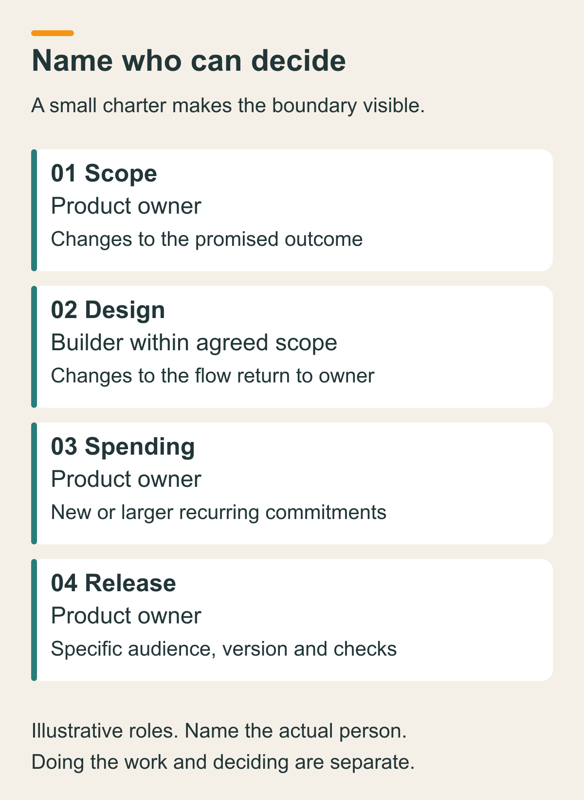
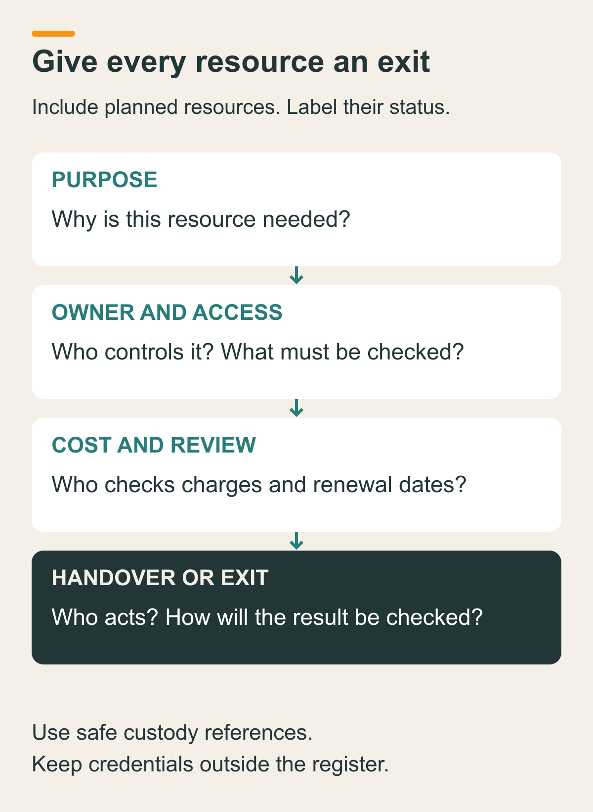

# Set up ownership, constraints and project administration

You can agree on what a product should do and still leave its most expensive decisions unclear. Who can approve a subscription? Who owns the repository? Who decides whether a working prototype is ready to go live? What happens to the accounts if the project stops?

Before you make those commitments, write a compact project charter and a small account register. Together, they should show who can decide, what limits apply, which resources the project depends on, and how you would hand them over or stop using them.

You do not need a company handbook. You need enough clarity that the next person, including your future self, can act without guessing.

## Start with the next commitment

This step helps before a collaborator joins, a paid service renews, a hosted environment starts collecting data, or a prototype becomes a public promise. It also helps when you inherit a project whose accounts belong to several people.

Bring four inputs: the intended outcome, the people involved, the resources you already use or expect to need, and the constraints you know. If you have an opportunity brief, reuse its purpose and non-goals. If you do not, write a provisional sentence about who the project serves and what change it should make possible.

Start from the commitment in front of you. A local sketch may need only one owner and a short stop rule. A hosted trial needs clearer access, cost, data and exit decisions. Expand the record when the consequences expand.

## 1. Separate doing the work from deciding

For each material decision, record one accountable decision owner and the person doing the work. They may be the same person. Add a reviewer only when another perspective or a required check makes the decision better.

Cover at least four decisions:

- **Product scope:** Who can change the promised outcome or add a feature?
- **Design:** Who resolves a tradeoff in the experience, and when must it return to the product owner?
- **Spending:** Who can approve a purchase, renewal or increase in recurring cost?
- **Release:** Who can authorize making a specific version available to the intended audience?

Write what the builder can decide without another conversation. For example, they may refine labels and spacing within the agreed workflow. Adding an external notification service changes cost and data exposure, so it returns to the named owner.

Avoid a row that says "everyone" owns a decision. Name the person who resolves disagreement and the input they need. When one person fills every role, write that once and still keep the decisions separate. Finishing the implementation does not itself answer whether the release is acceptable.

Your charter can now state the purpose, current stage, included work, non-goals, decision owners, limits and next review trigger. A stage such as "local demonstration using invented records" is more useful than an ambiguous label such as "launching soon."

## 2. Make the resource register useful without storing secrets

List resources the project relies on: repository, hosting, data storage, identity service, domain, design files and communication tools, where applicable. Include planned resources, but label them planned. A row is not evidence that an account exists or access works.

For each resource, record:

- its purpose and status;
- the accountable owner and the operator who maintains it;
- who needs access and at what level;
- where recovery instructions and secrets are held, using a safe reference;
- its cost or renewal check;
- what must happen on handover or shutdown.

Keep passwords, tokens, recovery codes and private customer details out of this register. "Owner's private credential store" is a custody reference. It does not prove that recovery is configured. Record access and recovery checks separately, with a date and an honest state such as planned, checked or blocked.

Account ownership and permission to work are separate details. On GitHub, the available roles depend on whether the repository belongs to a personal account or an organization. Check the actual account and role before assuming someone can manage access or billing. [GitHub's access permissions documentation](https://docs.github.com/en/get-started/learning-about-github/access-permissions-on-github) explains that distinction.

For handover, specify who receives control, which access must change, and how the result will be checked. Do not assume every provider supports transferring ownership. If that capability is unknown, assign the question before depending on it.

For shutdown, name the operator who stops usage and recurring charges, handles the agreed data disposition, and removes project access when authorized. Keep unrelated resources out of the action. "Delete everything" is not a useful exit plan.

## 3. Turn constraints into decisions you can use

"Keep costs low" is difficult to act on. A usable constraint names a limit, its period, who checks it, and what happens when it would be exceeded.

Separate one-time costs, recurring costs and usage-dependent costs. Record what is known, what is only estimated, and which renewal or trial date needs attention. A selected plan is not proof of the actual bill. Check the current account settings before making a purchase or starting usage.

Use a budget envelope with a response: if a proposed commitment or forecast crosses the limit, pause that commitment and return to the spending owner. A document cannot enforce a provider's billing behavior. Where available, examine the provider's actual alerts, limits and renewal controls, and record what they do and do not cover.

Apply the same pattern to time and data. For a short trial, set a review date and name who ends or extends it. State which records may be used, who may see them, and what question needs resolving before introducing another data category.

Invented business records can keep an example simple, but a real hosted account can still involve real login or account metadata. Do not describe all provider data as fictional merely because the sample requests are invented.

## 4. Give unresolved questions an owner and a consequence

You do not have to resolve every legal, tax, licensing or privacy question to write a charter. You do have to show which action depends on the answer.

For each open question, record the question, its owner, the appropriate person or source to consult, and the commitment that must wait. For example: "What rights do we need for this asset? The product owner will obtain appropriate advice before it appears in a public release."

Do not turn a checklist into a legal conclusion. This method records uncertainty and responsibility. It does not establish an entity, determine tax treatment, grant a license or prove compliance.

Some unknowns can remain open during reversible local work. Others block the next action. Distinguish the two explicitly so an unfinished question neither disappears nor stops unrelated work unnecessarily.

## Illustrative example: a shared request tracker

This example is fictional. The people, amounts and dates below are planning choices, not measured project results.

**Purpose and stage:** Demonstrate a workflow that shows each accepted request's owner, status and next action. Start with a local demonstration using invented requests. No public release, real customer records or automatic messages are included.

**Decisions:** The product owner decides scope, spending and release. The builder can refine the interface within the accepted request flow. Changes to data use, recurring cost or audience return to the product owner. The builder records the checks needed for a release decision.

**Budget:** Illustrative ceiling of US$30 for a one-month trial. A possible hosting option is estimated at US$10 per month, but its actual price, usage charges and renewal settings are unverified. No purchase is approved by writing the estimate. The owner checks the forecast before any paid commitment and pauses it if the total would exceed the ceiling.

**Repository:** Planned private repository controlled by the product owner. The builder needs access to contribute. The owner must verify the actual permission level and recovery route. On handover, the owner reviews access and confirms the receiving operator can maintain the project. On shutdown, remove project access when authorized and retain or dispose of the code according to the agreed decision.

**Hosting and data:** A future test environment has a named operator, a review date one month after it begins, and an owner decision to extend or stop. Before setup, verify billing, access and what real account data the provider requires. Before shutdown, agree what to retain or export, stop activity, and verify the relevant charges and access have ended. No environment has been created for this example.

**Open question:** Permission to use an external illustration remains unresolved. The product owner will check the license before public use. The local workflow exercise can continue without that asset.

The example gives you an actionable boundary without pretending the product is launched, the accounts are configured or professional questions are settled.

## Check the charter against an ordinary change

Pick one realistic change: a new collaborator, a paid renewal, a public link or a project shutdown. Walk through it without performing the action.

Can you identify who decides, who acts, which limit applies, what must be checked first, and how you would confirm the result? If the answer is "we will work it out later," repair that part of the record.

Then check every required resource. Each should have an owner, a purpose, a cost or renewal check, and an exit action. Missing access, unverified recovery and uncertain billing stay visible. You are checking the plan's completeness here, not claiming the operational actions have passed.

Keep the charter and register together. Review them when the audience, collaborator, cost, data use, stage or ownership changes. Preserve the previous version and record which decision changed.

## The smallest useful version

For a solo local experiment, start with six lines: purpose, current stage, one decision owner, limits on time and spending, permitted data, and a stop or review trigger. List only the resources you actually need. You can omit providers that the project does not use.

Add a fuller register before shared access, external services, recurring charges or a handover make it necessary. More rows do not make the project safer by themselves. Clear owners, honest unknowns and usable next actions make the record worth keeping.

Your next useful move is to walk through the charter with the people who must act on it. Resolve the questions that block the next commitment, then use the agreed boundary to shape a small complete experience.
