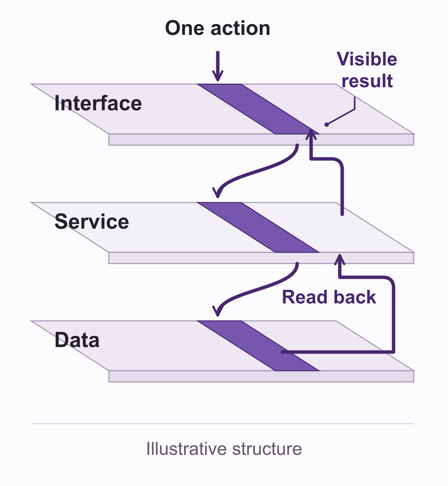

# Scope the first complete user experience

A feature list can get smaller while the work stays just as uncertain. "Create a request" sounds modest until you ask what happens after someone presses Save. Does the service accept it? Can another view read it? What does the person see if the response disappears?

Before you turn the idea into a backlog, define one small experience that reaches an observable result. Include the work needed to make that path usable, the failure you will handle, the recovery you will demonstrate, and the checks that decide whether the increment is complete.

The result is a scope and acceptance map. It gives you a useful boundary for implementation and a clear account of what a demonstration can prove.

## Start with one action and one visible result

Bring three inputs: the user situation, the intended change, and the constraints you have already chosen. If they are still uncertain, mark them as assumptions. You can scope a provisional example without pretending the product direction is validated.

Write the outcome in this form:

**When [role] performs [action] in [starting state], they can observe [result], under [named conditions].**

For a fictional shared request tracker:

When a coordinator submits a request in an isolated test workspace, they can see its recorded owner, status, and next action in the shared list, and see the same request after reloading.

This statement gives the slice a start and a finish. "Build the request form" leaves the finish open. "Improve coordination" promises a result that needs evidence beyond a software demonstration.

Choose one role, one action, and one environment first. Add another only if the intended result depends on it. Keep the broader product promise nearby so you can explain which part this increment delivers.

This method helps when a feature touches several components, when handoffs are unclear, or when a prototype is about to become working software. A tiny copy correction with an established outcome and existing checks usually needs a smaller task description.

## Trace the path across the system

Follow the action through the components that must cooperate. In the illustrative tracker, the path is:

1. The interface collects a title and shows the assigned owner.
2. The service checks the input and the permitted workspace.
3. The data store records the request and its stable identity.
4. The service returns or retrieves that recorded result.
5. The interface shows the owner, status, and next action in the list.

Illustrative structure. The return path confirms the stored result. Any essential external dependency adds its own acceptance obligation.

A slice crosses the layers needed for one result. A layer-sized task, such as building every form or every endpoint, can support later work, but it leaves the complete experience waiting on other pieces.

At each handoff, ask what the next component receives, what it can reject, and what the user will observe. "Wire up the API" is too vague to close that gap. For this example, the interface and service need an agreed request shape, validation response, workspace rule, and recorded-request identity.

Include an external surface when the result requires one. If the promise ends with an email visible in a mailbox, the sender integration, destination, failure handling, and mailbox check belong in the slice. Provider acceptance alone does not prove that someone read the message. The tracker example can end in the shared list, so email is explicitly deferred.

## Include the work around the feature

The central action rarely covers all the work needed for a demonstration. Add the surrounding obligations before estimating or assigning the slice.

**Setup:** Name the environment, allowed actor, starting data, and required configuration. For the fictional tracker, use one isolated workspace with fabricated requests and a predefined owner. If authentication or workspace access is missing, assign that work rather than assuming it exists.

**Integration:** Name every required handoff. Include the read path as well as the write path. A service response and a refreshed list need to refer to the same stored request.

**Verification:** Specify what will be observed at each important boundary. Decide how you will check the visible result, stored record, access rule, and recovery. Include keyboard access and clear state messages on the actual user path.

**Cleanup:** Say how the demonstration ends. Name the disposable records and resources, who removes or stops them, and how removal is checked. The example uses only fabricated records in its isolated workspace. Shared or real records would need a different, explicitly authorized cleanup plan.

Give each obligation one accountable owner. One person may own several rows. When two people contribute, assign the handoff and final check clearly so a shared row does not become an unowned row.

If you cannot name an owner or a needed input, mark the gap. You may be ready to build through a particular checkpoint while the complete outcome remains blocked. That is a useful planning result.

## Choose a failure and define recovery

Use a failure that could interrupt the chosen result. Do not add a catalogue of every possible outage to a first slice. Start with the boundary where an incorrect success claim would mislead the user.

For the fictional tracker, choose a lost response after submission. The service may have stored the request, but the browser has not received confirmation. Displaying "Saved" would claim more than the interface knows. Submitting a fresh request immediately could create a duplicate.

Define the intended behavior before implementation:

- Keep the entered content and the identity of the submission attempt.
- Show that the result is unconfirmed, with an available next action.
- Use that identity to check whether the request was recorded.
- If the record is found, show that same request in the list.
- If absence is authoritatively established, permit a retry using the same attempt identity under the service's retry-safe contract.
- If the outcome remains unknown, keep it unconfirmed and provide a safe way to check again or get help.

This is a proposed behavior for the example, not a tested implementation. Stable attempt identity, lookup, and retry handling are integration work. A button labeled Retry does not establish them.

Recovery has its own finish condition: the interface and stored state agree about the same request, and the user can continue without a duplicate. Restored connectivity is an input to that check; it cannot establish the result by itself.

For another slice, the most useful failure might be invalid input, an expired session, or an unavailable external service. Choose it from the user promise and likely uncertainty. Preserve any existing safety or access requirements even when you narrow the scenario.

## Turn the boundary into observable checks

Write each acceptance row as a condition, an observation, and a reason to fail it. Give it an owner and a place to record the actual result.

For the illustrative success path:

**Condition:** The coordinator submits one valid request in the permitted test workspace.

**Observation:** One stored request identity matches the list entry's owner, status, and next action. Reloading retrieves that same identity and content.

**Fail if:** The interface reports success before confirmation, shows different content, loses the request after reload, or creates more than one record for that attempt.

For the lost-response path:

**Condition:** The response is withheld after the service records the request.

**Observation:** The interface preserves the input and marks the outcome unconfirmed. A later lookup resolves to the same stored request. Repeating the permitted recovery action leaves one record for the attempt.

**Fail if:** Unknown becomes "Saved," entered content disappears, or recovery creates another request.

Check the real boundaries required by your intended demonstration. A mocked service can help you examine interface states, but record that boundary. It does not establish persistence or the behavior of an external provider. A shortened or simulated failure check needs the same honest label.

Use **Not run**, **Pass**, **Fail**, or **Blocked** for each check, with its observed evidence and limits. A written acceptance row is a test plan. Mark it Pass only after the named observation exists.

## Separate the increment from a release

Write two finish conditions. The first names what this slice will demonstrate. The second names the remaining work before the product can be offered under its broader promise.

For the fictional tracker, the increment demonstrates one permitted coordinator submitting a fabricated request, reading it back, and recovering from the selected lost response in an isolated environment.

Deferred work includes multiple collaborators editing together, notification delivery, migration of existing requests, other failure classes, and the operational and user evidence needed for the intended release. Record those obligations where the broader product scope is maintained. Narrowing this demonstration does not erase them.

A local result and a hosted result have different boundaries. Moving the same flow to a hosted environment can introduce identity, deployment, configuration, transport, and provider obligations. Name those when they become part of the intended result; do not treat a location change as automatic equivalence.

## Check the scope before you build

Read the map from the starting state to the visible result, then through the selected failure and recovery. Ask someone who has not seen the implementation plan to trace it with you.

The map is usable when:

- Every step required for the chosen result has an owner and an actual input, or a named blocking gap.
- Success, failure, and recovery each end in an observable state.
- Integration, setup, verification, and cleanup appear in the work inventory.
- The checks can reject an incomplete result rather than only confirm that files exist.
- The demonstration's evidence ceiling and deferred release work are explicit.

Use a scope and acceptance map to record these choices. Start with the outcome sentence, trace the path, then assign each obligation once. A filled fictional example can check planning completeness; its software checks remain Not run until executed.

For a small, reversible change, keep the map to six lines: action, visible result, path, selected failure, recovery, and completion check. Add ownership and cleanup only at the detail the change needs. Reuse established contracts where they already cover the path.

You are ready for the next step when the slice is small enough to explain and complete enough to check. Use that boundary to choose the implementation sequence. Keep any unresolved input as a visible checkpoint rather than expanding the feature list around it.
