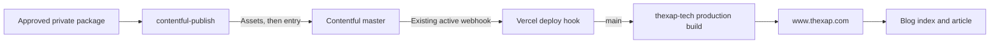

# Contentful to Vercel release runbook

Status: XAP-210 read-only audit completed on 2026-09-22

Canonical publication contract: [`visual-tutorial-publication-contract.md`](visual-tutorial-publication-contract.md)

Publisher lifecycle and recovery: `/Users/xavierperez/tools/contentful-publish/README.md`

Renderer contract: [`visual-tutorial-renderer.md`](visual-tutorial-renderer.md)

This runbook covers the existing Contentful to Vercel handoff for `thexap.com`. It does not grant permission to publish Contentful content, trigger or redeliver a webhook, create a deployment, promote, redeploy, roll back, or change production configuration.

## Completion rule

Treat every row below as a separate evidence state. Earlier success never proves a later state.

| State                                                | Required evidence                                                                                                                                                                             | Evidence owner                  |
| ---------------------------------------------------- | --------------------------------------------------------------------------------------------------------------------------------------------------------------------------------------------- | ------------------------------- |
| 1. Contentful draft exists                           | The private publisher receipt and a read-only `status` result agree on the exact package, content version, hashes, entry version, fields, Assets and draft or changed state.                  | Publisher and Contentful        |
| 2. Exact Assets and entry are published              | Every required Asset and the entry have published versions/timestamps, and the Content Delivery API readback matches the approved payload.                                                    | Publisher and Contentful        |
| 3. Contentful accepted and delivered the webhook     | The call detail matches the published entry, topic, environment and target, and records an HTTP success response.                                                                             | Contentful webhook history      |
| 4. Vercel created a build                            | A new deployment record exists in the expected project, branch and production environment after the matching webhook response.                                                                | Vercel                          |
| 5. The build succeeded                               | Vercel exposes an independent successful build result or completed build log for that deployment. A creation timestamp or `BUILDING` state is insufficient.                                   | Vercel build record             |
| 6. The production deployment became ready            | The same deployment reaches `READY` in the production environment.                                                                                                                            | Vercel deployment record        |
| 7. The article URL responds successfully             | The canonical article URL returns HTTP 200 after the Ready timestamp.                                                                                                                         | Public website                  |
| 8. The index and article render the approved package | Article and index match the approved title, date, excerpt, tags, body, hero, inline visuals, captions, attribution, PDF, DOCX and interactive link. Accessibility and responsive checks pass. | Public website and owner review |

Call the release complete only when every applicable row passes for the same approved package and the final entry-triggered deployment. Use `unavailable`, `not applicable`, `queued`, `building`, `failed`, `canceled` or `blocked` when that is the evidence.

## Current architecture and ownership



| Surface                                 | Current owner                         | Responsibility                                                                                                                                                                  |
| --------------------------------------- | ------------------------------------- | ------------------------------------------------------------------------------------------------------------------------------------------------------------------------------- |
| Publication package and private receipt | Xavier's private content workspace    | Exact approved inputs, hashes, remote identity/version custody and publication approval reference.                                                                              |
| Publisher                               | `contentful-publish`                  | Validate, create/resume/status one draft, publish the exact approved Assets and entry, and confirm Content Delivery API readback. It does not verify the webhook or deployment. |
| Contentful                              | Xavier's Contentful account and space | Store the `blog` entry and Assets, expose delivery state, and deliver the existing webhook. The authenticated owner used for this audit created and last updated the webhook.   |
| Vercel                                  | Xavier's `thexap-tech` project        | Own the secret-bearing deploy-hook URL, bind the hook to `main`, build the repository snapshot and assign a successful production deployment.                                   |
| Website repository                      | `thexap_tech`                         | Own the renderer, public metadata and repository delivery.                                                                                                                     |
| Xavier                                  | Publication and production owner      | Approve the exact version, CMS publication, any recovery action, production code release, rollback and final visual acceptance.                                                 |

The deploy-hook URL is credential material. Vercel project administrators can view or revoke it. Contentful space administrators can view or replace the stored destination. The current Contentful definition has no custom headers; the opaque URL path is the secret. Never copy that URL, tokens, provider IDs or raw logs into Git, Linear, screenshots or chat.

## Current integration audit

The following facts were read from current configuration on 2026-09-22. No configuration was changed and no trigger was sent.

### Contentful

- Exactly one webhook definition exists for this handoff: `Vercel - Deploy a site`.
- It is active.
- It targets the HTTPS Vercel deploy-hook host using the secret-bearing deploy path.
- It is filtered to environment `master`.
- It listens to `Entry.publish`, `Asset.publish`, `Entry.unpublish` and `Asset.unpublish`.
- It sends JSON and has no custom request headers.
- The visible health window contains 17 calls, all healthy. Every visible call returned HTTP 201. No failure was visible.
- All 17 visible calls are from the XAP-157 publication window on 2026-09-20. The audit did not generate a newer call.

The Asset topics matter. The XAP-209 publication order publishes the required Assets before the entry, so one visual tutorial publication can create several production deployments. Superseded builds can be canceled while a later build proceeds. The final release candidate is the deployment attributable to `ContentManagement.Entry.publish`, not the first Asset-triggered deployment.

### Vercel

- Project: `thexap-tech`.
- Deploy hook name: `Contentful`.
- Deploy-hook branch: `main`.
- Historical calls created production-targeted deployments from the then-current `main` commit.
- The currently served production revision and current remote `main` both resolve to `befd5b5fbaa93d7f9ecb9a14ec1d6de47d2eb289` at audit time.
- XAP-208 commit `c852bd4ebf1ee1518118f88eae396b569b3264b6` is on `develop` and is not an ancestor of current `main`.

That last point is a release gate for XAP-130. Publishing the article before a separately authorized production code release would rebuild `main` without the XAP-208 visual tutorial renderer.

### Current public readback

At 2026-09-22T16:32:23Z:

- `https://www.thexap.com/blog/choosing-a-beachhead` returned HTTP 200.
- The article rendered the current Contentful title, editorial date, Product Development tag and a Contentful-hosted featured image.
- `https://www.thexap.com/blog` returned HTTP 200 and its card matched the article title, date and tag.
- Article and index came from the same public build.
- The legacy article has no PDF or DOCX links, so it cannot prove the new resource renderer.
- The selected legacy article did not expose the XAP-208 canonical metadata behavior on current production.

XAP-208's tests and review evidence prove the renderer on `develop`. They are not production evidence.

## Historical trace: XAP-157

This trace uses the existing private XAP-157 receipt, current Contentful call history, current Vercel historical deployment records and a fresh public readback. It is evidence that the path worked for this event. It is not a new publication test and does not prove future health.

Selected entry: `choosing-a-beachhead`

| State                                     | Observed evidence                                                                                                                                                                                                                    | Result                                                                                         |
| ----------------------------------------- | ------------------------------------------------------------------------------------------------------------------------------------------------------------------------------------------------------------------------------------ | ---------------------------------------------------------------------------------------------- |
| Contentful draft or changed entry         | The private XAP-157 receipt records the entry update/version before republishing. The private entry ID is not copied here.                                                                                                           | Observed in private receipt; no public timestamp.                                              |
| Exact entry published                     | Contentful publication readback recorded `2026-09-20T17:35:07.499Z`. Assets were unchanged existing published Assets, so an exact Asset publication transition is not applicable to this metadata-only release.                      | Passed for entry; Asset transition not applicable.                                             |
| Webhook accepted and delivered            | Matching entry ID and slug were confirmed privately in the call body. Contentful sent `ContentManagement.Entry.publish` for `master` at `17:35:08.644Z`; Vercel responded HTTP 201 at `17:35:14.853Z`.                               | Passed. Request began 1.145 seconds after publication.                                         |
| Vercel created a build                    | A production deployment for `thexap-tech`, branch `main`, commit `300d85a1f1db77d7e5dd5ad9446f41334c4bc5e4` was created at `17:35:16.755Z`.                                                                                          | Passed. Creation was 1.902 seconds after the webhook response.                                 |
| Build succeeded                           | The deployment record entered build at `17:35:18.174Z` and later became Ready. The connector's detailed build-log operation was unavailable, so a distinct build completion timestamp/log was not observed.                          | Not independently observable. Do not invent a separate completion time.                        |
| Production deployment ready               | The same production deployment reached `READY` at `17:36:23.379Z`.                                                                                                                                                                   | Passed. Ready was 75.880 seconds after Contentful publication.                                 |
| Article URL responds                      | Fresh audit readback returned HTTP 200. XAP-157 also recorded an HTTP 200 production check after its release.                                                                                                                        | Passed currently; the fresh check is not proof of the historical response time.                |
| Index and article render approved content | Fresh audit matched title, date, tag and featured-image host between the article and index. XAP-157 recorded the same release family after publication. PDF, DOCX and captions were not part of this legacy package. | Passed for applicable legacy fields; new visual tutorial fields remain untested in production. |

Observed elapsed time is a useful baseline, not a service-level guarantee.

## Pre-publication checklist

Complete this checklist before asking Xavier for Contentful publication authorization.

### Package and approval

- [ ] The package passes `validate` and `dry-run` against the canonical schema.
- [ ] `status` agrees with the private receipt and exact reviewable manifest.
- [ ] `contentVersion`, `contentHash`, `manifestHash` and reviewed Contentful entry version match Xavier's exact-version approval.
- [ ] Hero, three inline visuals, PDF, DOCX and their hashes/metadata match the approved package.
- [ ] The article links only to approved public HTTPS destinations and public Contentful delivery URLs.
- [ ] Tags, title, excerpt, editorial date, slug, alt text, captions and attribution are final.
- [ ] The explicit Contentful publication authorization names the package/version and action.

### Production code and configuration

- [ ] Remote `main` contains the approved XAP-208 renderer commit, or a named successor with equivalent verified behavior.
- [ ] The current production deployment serves that same `main` revision before CMS publication.
- [ ] The Contentful webhook is still active, still filtered to `master`, and still targets the single Vercel deploy hook.
- [ ] The Vercel deploy hook is still named `Contentful`, targets `main`, and belongs to project `thexap-tech`.
- [ ] No second webhook or parallel deployment mechanism exists for this publication.
- [ ] No unrelated production release is running. Record any concurrent `main` deployment before publication.

### Evidence custody

- [ ] The private receipt path is available and mode-restricted.
- [ ] The operator can inspect Contentful call history and Vercel deployments read-only.
- [ ] The privacy-safe release receipt template below is ready.
- [ ] Tokens, opaque deploy-hook paths, Contentful/Vercel IDs and raw logs will remain in private custody.

If any production code or configuration check fails, stop before CMS publication. A Contentful publish would trigger production builds immediately.

## Expected timing and bounded polling

Use these bounds to prevent blind retries and endless polling.

| Evidence                                   | Observed XAP-157 baseline                                       | Poll rule                                                                                                            | Bound and result                                                                                                                                                                                                                   |
| ------------------------------------------ | --------------------------------------------------------------- | -------------------------------------------------------------------------------------------------------------------- | ---------------------------------------------------------------------------------------------------------------------------------------------------------------------------------------------------------------------------------- |
| Contentful published readback              | Publisher confirms the exact entry before stopping writes.      | Use the publisher result and one read-only `status` reconciliation if uncertain.                                     | If exact publication cannot be established, stop. Do not continue to webhook evidence.                                                                                                                                             |
| Webhook call appears                       | 1.145 seconds after selected entry publication.                 | Poll the Contentful call overview every 5 seconds.                                                                   | Stop after 60 seconds. Record missing/unknown instead of republishing.                                                                                                                                                             |
| Webhook response                           | HTTP 201 after 6.209 seconds for the selected call.             | Once the call appears, inspect only that call.                                                                       | Contentful retries 429 and 5xx responses up to two additional times, about 30 seconds apart. Its documented 30-second timeout is considered failed and is not retried. Wait through the one-minute retry window before escalation. |
| Vercel deployment appears                  | 1.902 seconds after the matching webhook response.              | Poll the project deployments every 5 seconds, matching project, production target, `main`, commit and creation time. | Stop after 60 seconds. A 201 webhook response without a deployment is a gap, not permission to republish.                                                                                                                          |
| Vercel deployment reaches a terminal state | 75.880 seconds from publication to Ready in the selected trace. | Poll every 15 seconds while `INITIALIZING`, `QUEUED` or `BUILDING`.                                                  | After 10 minutes, record stalled and escalate. Vercel documents a 45-minute maximum build duration, but this runbook does not wait unattended or declare failure early.                                                            |
| Public routes settle                       | Not independently timestamped in the trace.                     | After the final entry-triggered deployment is Ready, poll article and index every 10 seconds.                        | Stop after 2 minutes. Record stale or unavailable output and inspect the deployment/content layers before any recovery action.                                                                                                     |

References:

- Contentful [webhook calls API](https://www.contentful.com/developers/docs/references/content-management-api/webhook-calls/) and [retry policy](https://www.contentful.com/developers/docs/extensibility/webhooks/overview/)
- Vercel [Deploy Hooks](https://vercel.com/docs/deploy-hooks), [deployment overview](https://vercel.com/docs/deployments) and [deployment statuses](https://vercel.com/docs/cli/list)

## Vercel state meanings

| Vercel state   | Meaning for this release                                                                                  | Operator action                                                                                                                            |
| -------------- | --------------------------------------------------------------------------------------------------------- | ------------------------------------------------------------------------------------------------------------------------------------------ |
| `INITIALIZING` | Deployment exists but has not queued or built.                                                            | Continue bounded polling. No success claim.                                                                                                |
| `QUEUED`       | Deployment is waiting for a build slot or branch queue.                                                   | Continue bounded polling. Do not trigger another build.                                                                                    |
| `BUILDING`     | Build is running.                                                                                         | Continue bounded polling and preserve the start time.                                                                                      |
| `READY`        | Vercel reports the deployment successfully deployed and available.                                        | Confirm it is the final entry-triggered production candidate, then verify domains and public content.                                      |
| `ERROR`        | Build or deployment failed.                                                                               | Preserve a sanitized error summary and stop. A fix plus a rebuild/redeploy requires separate authorization.                                |
| `CANCELED`     | Deployment did not complete. It may have been superseded, canceled manually or stopped by platform rules. | Correlate a newer deployment from the same authorized publication. If no final entry-triggered candidate reaches Ready, stop and escalate. |

The webhook also fires for Asset publication. A canceled Asset-triggered build is not a failed article release when a later entry-triggered build is identifiable and Ready. A canceled final entry-triggered build is not acceptable.

## Evidence checklist after an authorized publication

### Contentful and webhook

- [ ] Record the exact private receipt transition for each Asset and the entry.
- [ ] Confirm all required Assets are published before the entry.
- [ ] Confirm Content Delivery API readback matches approved hashes, fields, metadata and body.
- [ ] Find the `ContentManagement.Entry.publish` call whose private entry ID matches the receipt.
- [ ] Record sanitized request/response timestamps, environment, topic, target host, status code and error count.
- [ ] Record Asset-triggered calls separately so they cannot be mistaken for the final entry event.

### Vercel

- [ ] Match the deployment created after the final entry webhook response.
- [ ] Confirm project `thexap-tech`, branch `main`, production target and expected Git SHA.
- [ ] Record created, building, independent build-complete evidence when available, and Ready timestamps.
- [ ] Distinguish every sibling deployment as initializing, queued, building, ready, error or canceled.
- [ ] Confirm the production domains point to the final Ready candidate. Keep provider IDs privately.
- [ ] Capture only a sanitized build summary. Never paste raw private logs into Linear or Git.

### Article

- [ ] GET the exact manifest `expectedPublicUrl` and require HTTP 200.
- [ ] Confirm exact title, date, excerpt, public tags and article body.
- [ ] Confirm canonical URL, description, Open Graph article/image fields and X card fields.
- [ ] Confirm one H1 and the approved heading order.
- [ ] Confirm the hero appears once with approved alt, visible caption and attribution.
- [ ] Confirm all inline visuals appear in manifest order with correct aspect ratio, alt, caption and attribution.
- [ ] Confirm image URLs use the expected Contentful delivery host and return successfully.

### Downloads

- [ ] Open PDF and DOCX links from the rendered resource callout.
- [ ] Require successful responses, expected MIME types, filenames and original-byte SHA-256 values.
- [ ] Confirm PDF/DOCX are rendered as resource links/cards and never as images.

### Blog index and accessibility

- [ ] Confirm exactly one index card for the slug.
- [ ] Match title, date, excerpt, tags and featured image to the article and approved manifest.
- [ ] Check desktop, tablet and 390 px mobile without horizontal overflow or image distortion.
- [ ] Check keyboard order, visible focus, link purpose, headings, alt/caption semantics and contrast.
- [ ] Check the browser console for errors.
- [ ] Obtain Xavier's visual acceptance before calling the public presentation complete.

## Safe recovery and escalation

### CMS publication is incomplete

1. Preserve the private receipt and sanitized publisher result.
2. Run the publisher's read-only `status` command.
3. Resume only the same exact authorized publication command after reconciliation.
4. If the entry is already published, do not republish to chase missing webhook or Vercel evidence.
5. Any different package, version, target, cleanup or repair needs fresh authorization.

### Webhook is missing or non-successful

1. Confirm the entry publication and exact call identity first.
2. Wait through the documented Contentful retry window for 429 or 5xx responses.
3. Preserve the status code, timestamps and sanitized error class.
4. Do not send a test call, redeliver, republish or create a second webhook.
5. Ask Xavier for a repair/redelivery decision. Name the exact event and proposed action.

### Vercel deployment is missing, stalled, errored or canceled

1. Confirm the webhook response and Vercel project/branch before diagnosing the build.
2. For queued/building states, follow the bounded polling rule.
3. For canceled deployments, determine whether a newer deployment from the same authorized Asset/entry batch superseded it.
4. For `ERROR`, capture the smallest sanitized build-log excerpt that identifies the failure.
5. Do not rebuild, redeploy, promote or change the deploy hook without fresh authorization.

### Ready deployment serves missing or stale content

1. Confirm the Ready candidate was created after the final entry webhook response.
2. Confirm its Git SHA contains the renderer required by the manifest.
3. Recheck Content Delivery API state and the exact public URL without CMS writes.
4. Check whether the wrong deployment is Current on the production domains.
5. Treat a code/config defect, stale CMS readback and wrong domain assignment as different problems.
6. Stop and request the specific repair action. Do not republish as a generic refresh.

## Rollback decisions

Rollback is a fresh owner decision, never an automatic consequence of a failed check.

| Problem                                     | Safe default                                                             | Action requiring explicit authorization                               |
| ------------------------------------------- | ------------------------------------------------------------------------ | --------------------------------------------------------------------- |
| Bad website code, CMS content still valid   | Preserve the failed and last-known-good deployment references privately. | Roll back Vercel to a named known-good deployment.                    |
| Wrong CMS content, website code valid       | Preserve the current entry/Asset versions and receipt.                   | Publish a reviewed corrected version or unpublish the exact entry.    |
| Wrong Asset bytes or accessibility metadata | Stop public acceptance and identify every affected reference.            | Publish corrected Assets/entry under a new approved content version.  |
| Wrong deployment is Current                 | Record Ready candidates and domain assignment.                           | Promote or roll back to a named deployment.                           |
| Webhook/configuration defect                | Preserve current definition, calls and failures.                         | Edit, replace or recreate the integration in a separate repair issue. |

Vercel rollback does not undo Contentful publication. Contentful unpublish does not restore prior website code. If both layers are wrong, Xavier must choose the order and exact targets.

## Authorization gates

| Action                                                        | Authorization required                                                                    |
| ------------------------------------------------------------- | ----------------------------------------------------------------------------------------- |
| Offline validate/dry-run                                      | Covered by the authorized chapter work.                                                   |
| Read-only Contentful/Vercel/public inspection                 | Covered by XAP-210 or the supervised release task.                                        |
| Create the first Contentful draft                             | Explicit draft-upload authorization for the named package/version.                        |
| Resume the same draft                                         | Existing bounded draft authorization after read-only reconciliation.                      |
| Exact-version approval                                        | Xavier must name content version, content hash, manifest hash and reviewed entry version. |
| Publish Assets and entry                                      | Separate explicit Contentful publication authorization.                                   |
| Automatic existing webhook consequence                        | Expected after authorized CMS publication, but still requires evidence.                   |
| Manual webhook redelivery/test                                | Fresh explicit authorization naming the event and target.                                 |
| Rebuild, redeploy, promote or rollback                        | Fresh explicit authorization naming the Vercel deployment/action.                         |
| Republish or unpublish CMS content                            | Fresh explicit authorization naming the entry/version/action.                             |
| Change hook, filters, branch, project, domains or environment | Separate repair/configuration issue and explicit authorization.                           |
| Delete/archive remote objects                                 | Fresh destructive-action authorization after an inventory.                                |

## Privacy-safe release receipt template

Keep remote entry/Asset IDs, webhook call IDs, deployment IDs, opaque URLs, tokens and raw logs in the private receipt. A Linear/Git-safe summary may use this template:

```markdown
## Publication handoff receipt

- Issue: XAP-\_\_\_
- Checked at: YYYY-MM-DDTHH:MM:SSZ
- Content version: \_\_\_
- Content hash: \_\_\_
- Manifest hash: \_\_\_
- Public article: https://www.thexap.com/blog/___
- Website Git SHA: \_\_\_
- Contentful publication: PASS | FAIL | BLOCKED | UNAVAILABLE
  - Exact Assets published: PASS | FAIL | N/A | UNAVAILABLE
  - Exact entry published: PASS | FAIL | UNAVAILABLE
  - Delivery API readback: PASS | FAIL | UNAVAILABLE
- Webhook: PASS | FAIL | BLOCKED | UNAVAILABLE
  - Topic/environment: ContentManagement.Entry.publish / master
  - Request/response times: **_ / _**
  - Sanitized outcome: HTTP **_; error count _**
- Vercel: READY | ERROR | CANCELED | QUEUED | BUILDING | UNAVAILABLE
  - Project/branch/environment: thexap-tech / main / production
  - Created/building/build complete/ready: **_ / _** / **_ / _**
  - Private deployment reference: stored in private receipt
- Public verification: PASS | FAIL | BLOCKED | UNAVAILABLE
  - Article/index: \_\_\_
  - Images/captions/attribution: \_\_\_
  - PDF/DOCX: \_\_\_
  - Tool route: \_\_\_
  - Desktop/tablet/390 px/accessibility: \_\_\_
- Unavailable evidence: \_\_\_
- Recovery action taken: none | separately authorized action and reference
- Owner visual acceptance: PASS | PENDING

No Contentful/Vercel private IDs, secret-bearing URLs, tokens or raw private logs are included.
```

## Audit limitations and remaining supervised work

- No new Contentful publication, webhook, build or deployment was triggered for XAP-210.
- The visible Contentful call history ends with XAP-157 on 2026-09-20. Current configuration and health were readable, but a future call can still fail.
- Detailed Vercel build logs and a distinct historical build-complete timestamp were unavailable through the connected read-only deployment tool. Deployment creation, build-start and Ready timestamps were available.
- The exact historical production-domain assignment time for the selected XAP-157 deployment was unavailable. Current article/index readback is separate evidence.
- The selected historical article is metadata-only legacy content. It cannot prove PDF, DOCX or tutorial caption rendering.
- At audit time, production `main` did not yet contain XAP-208. A separately authorized production code release and live readback had to precede XAP-130 CMS publication.
- The XAP-130 exact package/version approval, Contentful publication, resulting build/deployment and full public visual/resource verification remain supervised work.
- This audit does not claim XAP-130 publication or a new production deployment.
- XAP-210 repository verification passed lint, Prettier, the visual-tutorial and portfolio suites. The production build compiled successfully but could not finish static page generation because repeated Contentful GraphQL connections timed out; this is unavailable build evidence, not a passing build.
