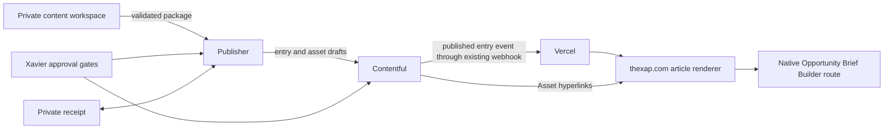
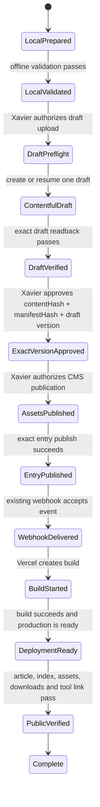

# Visual tutorial publication contract

Status: canonical decision record for XAP-206

Contract version: 1.0.0

Manifest schema: [`visual-tutorial-publication-manifest.schema.json`](visual-tutorial-publication-manifest.schema.json)

Fictional example: [`visual-tutorial-publication-manifest.example.json`](visual-tutorial-publication-manifest.example.json)

This contract defines how a private visual tutorial package becomes a Contentful-backed article on `thexap.com`. It is an implementation contract, not permission to upload, publish, deploy, post to social media or clean up remote data.

## Decisions

1. Contentful owns the blog entry, Contentful metadata tags, featured image, inline publication images and public PDF/DOCX files.
2. `thexap.com` owns the article renderer, metadata rendering and interactive application code.
3. Interactive tools are normal website routes linked from the article. They are not HTML, CSS or JavaScript files uploaded to Contentful. The Opportunity Brief Builder route is permanently `https://www.thexap.com/tools/opportunity-brief-builder` unless Xavier separately approves a route and redirect decision.
4. Downloads use Contentful Asset hyperlinks inside the existing `blog.body` RichText field. This uses the live schema's existing `BlogBodyAssets.hyperlink` capability. No Contentful model change is required.
5. Image alt text lives in the Contentful Asset `description`. Caption and attribution stay separate in generated RichText caption paragraphs. The Asset `title` carries a small machine-readable presentation key so the website can associate the right caption without a new content type.
6. The publisher consumes one schema-valid manifest, fails before writes on any local mismatch, and uses a private durable receipt to create, update or resume one draft. A rerun may not create another entry or another copy of a known asset.
7. All assets remain draft while the entry is a draft. Asset processing is allowed during draft preparation. Publishing assets and publishing the entry are separate, ordered transitions.
8. Xavier's exact-version approval, Contentful publication authorization and social posting authorization are independent decisions.
9. Publishing the Contentful entry uses the existing Contentful-to-Vercel webhook. This contract does not create or authorize a second webhook.
10. CMS publication, webhook delivery, Vercel build creation, successful build, ready production deployment and verified public rendering are separate evidence states.

The current live GraphQL schema was checked read-only on 2026-09-21. It exposes the existing `Blog` fields used below, Asset metadata and both block and hyperlink Asset collections for `Blog.body`. The repository's generated types agree. The current publisher does not yet satisfy this contract: it creates duplicates on rerun, publishes assets before a draft review, skips missing inline images and cannot upload downloads. XAP-209 owns those changes.

## Architecture



The Contentful article contains a normal HTTPS link to the native tool route. Contentful does not host the tool implementation. Vercel receives the existing webhook after Contentful publication. A webhook acceptance or a ready deployment does not prove that the expected page rendered correctly.

## Ownership matrix

| Surface            | Owner                         | What it owns                                                                                                                                            | What it must not own                                                                                            |
| ------------------ | ----------------------------- | ------------------------------------------------------------------------------------------------------------------------------------------------------- | --------------------------------------------------------------------------------------------------------------- |
| Content workspace  | Content authoring workflow    | Public Markdown, approved local images, PDF/DOCX files, visual plan, publication manifest and private editorial/evidence records                        | CMS state, website code, public deployment state or remote credentials                                          |
| Publisher          | `contentful-publish`          | Fail-closed validation, RichText conversion, Contentful draft creation/update, idempotent retry/resume, private receipt and explicit publish command    | Editorial decisions, new tags, schema mutations, website routes, Vercel configuration or social authorization   |
| Contentful         | CMS                           | `blog` entry, metadata tag links, featured Asset, inline image Assets, PDF/DOCX Assets and their draft/published versions                               | Interactive application code, website layout or proof that Vercel/public rendering succeeded                    |
| Website repository | `thexap_tech`                 | Blog queries, generated GraphQL types, article/asset rendering, SEO/social metadata, responsive and accessible presentation, native tool routes         | Private source evidence, CMS write credentials or Contentful publication state                                  |
| Vercel             | Existing deployment path      | Build and deployment created by the existing Contentful webhook                                                                                         | Editorial approval, CMS publication or public rendering verification                                            |
| Xavier             | Product and publication owner | Slug/route decisions, tags and public metadata, visual/accessibility decisions, exact-version approval, upload/publication/social/cleanup authorization | Routine implementation mechanics after a bounded action is authorized                                           |
| Linear             | Work ledger                   | Decisions, acceptance evidence, repository references, public-safe hashes and limitations                                                               | Tokens, Contentful/Vercel private identifiers, private evidence, raw logs or a second copy of the full contract |
| Social publisher   | Channel-specific workflow     | Approved LinkedIn/X copy, media selection, send receipt and public URL                                                                                  | CMS or website completion state                                                                                 |

## Public URL contract

All final URLs use HTTPS. Local paths, preview URLs, Contentful admin URLs and private workspace paths are forbidden in public article content.

| Resource                   | Required public form                                     | Rule                                                                                                                  |
| -------------------------- | -------------------------------------------------------- | --------------------------------------------------------------------------------------------------------------------- |
| Article                    | `https://www.thexap.com/blog/{slug}`                     | Exact manifest slug, no query, fragment or trailing slash                                                             |
| Opportunity Brief Builder  | `https://www.thexap.com/tools/opportunity-brief-builder` | Site-owned native route; do not upload the prototype files to Contentful                                              |
| Other interactive resource | `https://www.thexap.com/tools/{tool-slug}`               | Requires its own approved route issue; external vendors are not inferred by this contract                             |
| Image or download          | Exact processed Contentful Asset delivery URL            | Host must be `images.ctfassets.net` or `assets.ctfassets.net`; the admin URL and Asset ID stay in the private receipt |

A `prepared` manifest uses `null` for Contentful Asset URLs because no remote objects exist. A `reviewable` manifest must contain the exact processed Asset delivery URLs read from the draft. Those URLs are expected destinations, not proof that draft Assets are publicly delivered. The private receipt is the authority for remote IDs and state.

Once an article slug has been published, changing it is a route and SEO migration. Stop for a redirect/canonical decision instead of silently minting a new URL.

## Manifest contract

The publication manifest lives in the package root as `publication-manifest.json`. It is public-safe handoff metadata. It never contains absolute local paths, credentials, private evidence, Contentful admin URLs, remote object IDs or Vercel identifiers.

Schema 1.0.0 is in the adjacent JSON Schema file. Unknown properties fail because the schema uses `additionalProperties: false`. Schema validation is necessary but not sufficient; the semantic checks below are also mandatory.

### Required and nullable values

Every top-level field is required. This avoids silent defaults at a consequential boundary.

| Field                  | Requirement                                                                                                                     |
| ---------------------- | ------------------------------------------------------------------------------------------------------------------------------- |
| `schemaVersion`        | Exact supported manifest schema version. Version 1 requires `1.0.0`.                                                            |
| `profile`              | `prepared` before a Contentful draft, `reviewable` after draft readback.                                                        |
| `packageId`            | Stable public-safe identity for the tutorial across versions.                                                                   |
| `contentVersion`       | SemVer without a leading `v`, for example `1.2.0-rc.1`.                                                                         |
| `locale`               | `en-US` in schema 1.0.0, matching the current Contentful model and publisher.                                                   |
| `slug`                 | Lowercase kebab case. It must match the article URL and Contentful field exactly.                                               |
| `expectedPublicUrl`    | Exact canonical article URL on `www.thexap.com`.                                                                                |
| `contentHash`          | Hash of public content inputs and decisions, defined below.                                                                     |
| `manifestHash`         | Hash of the complete manifest, defined below.                                                                                   |
| `metadata`             | Title, explicit excerpt, editorial date and ordered Contentful public tag IDs.                                                  |
| `article`              | Package-relative `blog.md`, byte count, MIME type and SHA-256.                                                                  |
| `hero`                 | One required informative featured image with actual dimensions and accessibility metadata.                                      |
| `inlineVisuals`        | Required array, possibly empty. Each declared item must occur exactly once in the article and order must be contiguous from 1.  |
| `downloads`            | Exactly one PDF and one DOCX in schema 1. Both are required for the editable and print-ready companion.                         |
| `interactiveResources` | Required array, possibly empty. Site routes only.                                                                               |
| `resourceCallout`      | Required heading, introduction and `after-article` placement. The publisher builds it from downloads and interactive resources. |

Within an image record, `caption` and `attribution` keys are required but may be `null`. `alt` is required and non-empty unless `decorative` is true. The hero cannot be decorative. Licensed or third-party images require an attribution label and HTTPS URL. `expectedPublicUrl` is required but is `null` in the `prepared` profile and an exact Contentful delivery URL in the `reviewable` profile.

### Hashes

All SHA-256 values are lowercase hexadecimal.

1. Each declared file hash is `SHA-256` over the exact file bytes.
2. Build the content projection with these manifest members in this order-independent object: `packageId`, `contentVersion`, `locale`, `slug`, `expectedPublicUrl`, `metadata`, `article`, `hero`, `inlineVisuals`, `downloads`, `interactiveResources`, and `resourceCallout`.
3. Remove only `expectedPublicUrl` from `hero`, every inline visual and every download. Keep the article URL and every interactive route because they are editorial/public product decisions.
4. Serialize the projection with RFC 8785 JSON Canonicalization Scheme and hash its UTF-8 bytes. That result is `contentHash`.
5. To calculate `manifestHash`, copy the complete manifest, set `manifestHash` to 64 lowercase zeroes, serialize with RFC 8785 and hash its UTF-8 bytes.

Changing public text, tags, date, slug, accessibility text, caption, attribution, file bytes, ordering, callout copy or interactive destinations changes `contentHash` and requires a new `contentVersion`. Filling draft Asset URLs changes `manifestHash` but not `contentHash`. Exact-version approval names both hashes.

### Semantic validation

The publisher must finish every local check before creating an API client or making a Contentful request.

- The schema file itself compiles, and the manifest validates against the exact declared schema version.
- All paths are package-relative, stay inside the package root and resolve to regular files. Symlinks that escape the root fail.
- Declared byte counts, SHA-256 hashes, file signatures, extensions and MIME types match.
- Actual image dimensions match the manifest. Images are PNG, JPEG or WebP, no larger than 10 MB or 8192 pixels on either side.
- PDF and DOCX signatures match their declared MIME types and files are no larger than 50 MB.
- IDs, paths and file names are unique. Inline `order` values are exactly `1..n` with no gap or duplicate.
- The article has exactly one H1, and it equals `metadata.title` after trimming.
- `slug` equals the final article URL segment. The expected URL equals `https://www.thexap.com/blog/{slug}`.
- Tag IDs are unique and case-sensitive. A later read-only Contentful preflight proves they exist and are public before any write.
- The first standalone image reference after the H1 is the declared hero. It is used only as `featuredImage`, not duplicated in the body.
- Every remaining standalone local image reference matches one declared inline visual, in the same order, exactly once. Undeclared, missing or unused visual records fail.
- Every site link is an approved `https://www.thexap.com` URL. The Opportunity Brief Builder link, when present, is exactly `/tools/opportunity-brief-builder`.
- `prepared` manifests have null Contentful Asset URLs. `reviewable` manifests have non-null URLs matching the exact draft readback.
- Recomputed `contentHash` and `manifestHash` match.
- No public string contains an absolute local path, a secret, a private product identifier or private evidence.

No warning may downgrade these failures. A missing inline image, mismatched download, unknown tag, changed hash or unsupported Markdown is fatal.

## Markdown and conversion contract

Schema 1 accepts this deliberately narrow Markdown subset:

- one H1 used as the Contentful `title` and removed from `body`;
- H2 through H6;
- paragraphs and soft-wrapped paragraph lines;
- horizontal rules;
- flat ordered and unordered lists;
- bold, italic, inline code and inline HTTPS hyperlinks;
- standalone local image lines for the declared hero and inline visuals.

Schema 1 rejects fenced or indented code blocks, tables, blockquotes, nested lists, task lists, footnotes, reference-style links, raw HTML, MDX, remote Markdown images and relative hyperlinks. A later schema/publisher version may add a syntax only with conversion fixtures and renderer coverage.

The parser must prove it consumed every non-whitespace token. Validation compares block order, plain text, headings, list items, hyperlinks and image slots between source Markdown and generated RichText. Silent stripping, flattening or conversion to visibly different content fails before network access. The current converter's warn-and-skip behavior is not allowed.

Downloads and tool links do not appear as local Markdown links. The publisher appends the manifest-defined resource callout after the article, which prevents local/private paths from leaking into the public body.

## Contentful representation

The current `blog` content type and `en-US` locale remain unchanged.

| Contentful location               | Manifest/source                                          | Required mapping                                                                       |
| --------------------------------- | -------------------------------------------------------- | -------------------------------------------------------------------------------------- |
| `fields.title`                    | `metadata.title`                                         | Exact string                                                                           |
| `fields.slug`                     | `slug`                                                   | Exact string                                                                           |
| `fields.date`                     | `metadata.editorialDate`                                 | Store at `12:00:00-05:00` on that Ecuador calendar date; do not substitute upload time |
| `fields.excerpt`                  | `metadata.excerpt`                                       | Exact string, at most 256 characters; do not derive it during upload                   |
| `fields.featuredImage`            | `hero`                                                   | Link the one draft hero Asset                                                          |
| `fields.body`                     | `article`, inline visuals and generated resource callout | RichText mapping below                                                                 |
| `fields.tags`                     | none                                                     | Leave empty; this legacy Symbol is not the public tag source                           |
| `metadata.tags`                   | `metadata.tagIds`                                        | Existing public Contentful Tag links, exact case                                       |
| Asset `file`                      | image/download file record                               | Exact bytes, filename and MIME type                                                    |
| Asset `description` for images    | image `alt`                                              | Exact alt text, or empty only for a declared decorative inline image                   |
| Asset `description` for downloads | download `description`                                   | Plain accessible description                                                           |
| Asset delivery URL                | processed Asset readback                                 | Copy into the reviewable manifest, never infer it                                      |

### Image title and caption protocol

Image Asset titles use this ASCII protocol:

```text
vtp1|{slug}|{role}|{id}|c{0-or-1}|a{0-or-1}
```

`role` is `hero` or `inline`. `c1` means a caption is present, and `a1` means attribution is present. The publisher rejects values that would make the title longer than Contentful permits.

The publisher emits an `embedded-asset-block` for each inline visual. If `c1` or `a1`, the next body node is one paragraph containing the caption text, then `·` when both values exist, then the attribution as an HTTPS hyperlink when it has a URL. The website recognizes only `vtp1` titles, wraps the Asset and following caption paragraph in one semantic `figure`, and consumes that paragraph as `figcaption`. If both flags are zero, the following article paragraph remains normal prose.

The hero is the `featuredImage`, not a body block. If its title has `c1` or `a1`, the publisher places the same caption paragraph as the first body node. The website consumes it into the hero `figure` before rendering the remaining body. This rule keeps alt, caption and attribution separate without a new Contentful type. Legacy Assets without a `vtp1` title keep their safe legacy rendering and are never parsed as tutorial captions.

### Download and resource callout protocol

PDF and DOCX files are Contentful Assets. They remain draft while the entry is draft. At the end of `body`, the publisher appends:

1. one `heading-2` node with `resourceCallout.heading`;
2. one paragraph with `resourceCallout.intro`;
3. one unordered list;
4. one list item per download in manifest order, containing an `asset-hyperlink` whose visible text is the download label plus the human-readable format and size;
5. one list item per interactive resource in manifest order, containing a normal HTTPS `hyperlink`.

The website queries `body.links.assets.hyperlink` with `sys.id`, `title`, `description`, `url`, `contentType`, `fileName` and `size`. It renders PDF/DOCX links as accessible resource links or cards, never through `next/image`. Unknown file types render as a safe normal link or are omitted with a logged diagnostic; they do not crash the page.

The Opportunity Brief Builder list item links to `https://www.thexap.com/tools/opportunity-brief-builder`. It never links to `interactive/index.html` or another local prototype file.

## Accessibility and responsive images

- Alt text is the concise text alternative for the visual's useful meaning. It does not start with "image of" and does not contain credit or caption copy.
- A decorative inline visual has `decorative: true` and `alt: ""`. The hero is informative and cannot be decorative.
- Caption is optional visible context. Attribution is provenance/credit, independently optional for original/generated work and mandatory for licensed/third-party work.
- Attribution links have descriptive text. The renderer does not expose raw URLs as their only accessible name.
- Every image uses its actual Contentful width and height to reserve aspect ratio and prevent layout shift.
- Schema 1 permits `mobileBehavior: "scale"` only. The renderer preserves aspect ratio with `max-width: 100%` and `height: auto`, never introduces horizontal overflow and never stretches an image beyond its intrinsic width. Art-directed crops require a future contract version and an explicit visual decision.
- Hero and inline visual containers use the declared `presentation`: `hero`, readable `prose`, or bounded `wide`. Prose remains at a readable measure while wide visuals may escape that measure inside the article container.
- Images below the initial viewport load lazily. The featured image is prioritized only when it is the likely largest contentful paint element.
- Caption and attribution remain legible and ordered after the visual at desktop, tablet and 390 px mobile.
- Article verification covers heading order, keyboard navigation, visible focus, link purpose, contrast, reduced-motion behavior when relevant, no settled horizontal overflow and no console errors.

## Lifecycle and authorization



Any state can enter a recorded failed or unknown substate. A failure does not imply rollback, deletion, retry or completion.

| Transition/action                                                                              | Xavier authorization                                                                                                                            |
| ---------------------------------------------------------------------------------------------- | ----------------------------------------------------------------------------------------------------------------------------------------------- |
| Local preparation and offline validation already within an authorized chapter task             | No new CMS authorization                                                                                                                        |
| Select/change slug, tags, public metadata, hero, accessibility copy or interactive destination | Explicit owner decision when not already accepted in the chapter contract                                                                       |
| Create the first Contentful draft                                                              | Explicit draft-upload authorization                                                                                                             |
| Update/resume that exact draft after a known partial failure                                   | Covered by the still-active bounded draft authorization after read-only reconciliation; changing target or version requires fresh authorization |
| Approve exact reviewable manifest and Contentful draft                                         | Explicit exact-version approval naming `contentVersion`, `contentHash` and `manifestHash`                                                       |
| Publish Assets and entry                                                                       | Explicit Contentful publication authorization; editorial approval alone is insufficient                                                         |
| Existing webhook and configured Vercel build/deploy caused by that publication                 | Expected consequence of the authorized Contentful publication, not proof of success                                                             |
| Manual webhook redelivery, rebuild, redeploy, rollback or republish                            | Fresh explicit authorization naming action and target                                                                                           |
| Delete/archive Assets or entries, including orphan cleanup                                     | Fresh explicit destructive-action authorization after an inventory                                                                              |
| LinkedIn or X posting                                                                          | Separate destination-specific authorization                                                                                                     |

The publisher's `--publish` operation must require the exact manifest/content hashes and current Contentful entry version. It publishes the already reviewed draft. It must not rebuild the RichText or upload new bytes during publication.

## Idempotency, receipt and recovery

The idempotency identity is `packageId + contentVersion`. The stable article identity is `packageId`. The receipt maps that identity to one Contentful entry across content versions.

The private receipt belongs in the content workspace's private chapter area or another approved private publisher state directory. It is not committed to this website repository and is not pasted into Linear. It records:

- receipt format and publisher version;
- package ID, content version, content hash and manifest hash;
- Contentful environment identity by private custody reference, not token;
- entry ID, version, draft/published state and Contentful web-app URL;
- every Asset role/ID, remote ID, version, processing/publication state and delivery URL;
- operation ID, timestamps, last confirmed action and any sanitized failure;
- exact approval and publication authorization references without copying private evidence;
- webhook/build/deployment/public readback references when XAP-210 can observe them.

The receipt is written atomically after each remote object is created, reused, processed, updated or published. Keep append-only operation history so an uncertain result can be reconciled.

### Create, update and duplicate slug rules

1. Local validation passes.
2. Read the receipt and query Contentful by exact slug before writes.
3. If the receipt identifies one entry and remote state agrees, update/resume that entry.
4. If no receipt exists and no entry uses the slug, create one draft and persist its ID before the next remote write.
5. If one entry uses the slug but no trusted receipt binds it to the package, stop. Adoption requires explicit authorization after a field-by-field identity review.
6. If more than one entry uses the slug, stop with all candidate states. Never pick one or create another.
7. The same content version with a different content hash is invalid. Change the content version and revalidate.
8. A new content version updates the bound draft/changed entry. It does not create a second entry unless Xavier explicitly approves a migration with a different stable identity.

### Partial failure

- Report every remote object as created, reused, changed, processed, published, failed or unknown.
- On retry, inspect the receipt and current Contentful versions before any write.
- Reuse assets whose source hash, MIME type, dimensions and role match. Do not upload copies.
- If the result of a write is uncertain, reconcile by receipt ID and remote readback. Do not repeat the create call.
- Never delete or archive remote objects automatically. Produce a cleanup inventory and wait for authorization.
- If assets publish but entry publication fails, leave the entry draft, record the partially public Assets and resume publication only after reconciling versions.
- If entry publication succeeds but webhook/build evidence is missing, do not republish. XAP-210 inspects delivery and determines the authorized recovery path.

## Contentful draft and publication behavior

During draft upload:

- create/process Assets as drafts;
- create/update the `blog` entry as a draft or changed entry;
- do not publish any Asset or entry;
- verify through the Contentful web app and preview API;
- update the manifest to `reviewable` with processed delivery URLs, recompute `manifestHash`, and read back the exact draft;
- retain all IDs and versions only in the private receipt.

During publication:

1. revalidate the approved hashes, receipt binding, slug uniqueness, current entry version and current Asset versions;
2. confirm every referenced Asset is processed and still matches its receipt;
3. publish required Assets in receipt order and read each back;
4. publish the exact approved entry version and read it back through the Contentful delivery API;
5. stop Contentful writes;
6. observe the existing webhook, Vercel and public-site states without creating another trigger.

Contentful draft review does not prove public Asset delivery. Published Assets do not prove the entry is published. A published entry does not prove webhook delivery, a successful build or a correct public page.

## Evidence and definition of complete

A publication can be called complete only when all applicable evidence exists for the same approved hashes and remote entry version.

| Layer                    | Required evidence                                                                                                                                                                                                       |
| ------------------------ | ----------------------------------------------------------------------------------------------------------------------------------------------------------------------------------------------------------------------- |
| Local package            | Schema and semantic validation output; source SHA-256/bytes/MIME/dimensions; supported Markdown round-trip; no private/local links; PDF and DOCX inspection; contextual privacy review                                  |
| Contentful preflight     | Current `blog` fields/locale, public tag existence, unique slug result and no schema contradiction                                                                                                                      |
| Draft                    | Private receipt; entry/Asset draft IDs and versions; field-by-field readback; ordered inline images; hero not duplicated; Asset titles/descriptions; two download hyperlinks; tool link; zero unintended remote objects |
| Exact approval           | Xavier's record naming content version, content hash, manifest hash and the reviewed draft version                                                                                                                      |
| CMS publication          | Published versions/timestamps for every required Asset and the entry; delivery API field/metadata/body readback                                                                                                         |
| Webhook                  | Existing webhook delivery event, target, response/outcome and timestamp, or an explicit statement that evidence is unavailable                                                                                          |
| Vercel                   | Deployment/build identifier held privately, expected project/environment, source revision, build result and `READY` production state                                                                                    |
| Public article           | HTTP success for canonical URL; canonical/description/Open Graph/X metadata; exact title/date/tags/body; correct hero/figures/captions/attributions                                                                     |
| Public resources         | PDF and DOCX links resolve with correct MIME type, filename and original-byte hash; Opportunity Brief Builder route resolves and the article link targets it                                                            |
| Blog index               | One card for the slug with expected title, date, excerpt, tags and featured image                                                                                                                                       |
| Accessibility/responsive | Real-browser desktop/tablet/390 px checks, keyboard and focus, heading order, alt/caption semantics, no overflow/distortion, no console errors                                                                          |

`Complete` is an evidence conclusion, not a synonym for `entry.publish()` or `READY`. If a layer cannot be observed, record it as unavailable and stop short of complete.

## Security and privacy

- Tokens, secrets, signing values and environment variable contents stay in approved secret storage. Never print or persist them in manifests, Git, Linear, command output summaries or screenshots.
- Absolute local paths, private product identifiers, private evidence references and raw research never enter public files or the publication manifest.
- Contentful entry/Asset IDs, admin URLs, Vercel identifiers and raw webhook/build logs stay in the private receipt. Linear receives only public-safe hashes, repository references, command results and sanitized limitations.
- Public Contentful delivery URLs are allowed in a `reviewable` manifest because they are intended article destinations. They are not a substitute for private remote IDs or state.
- Use least-privilege read credentials for preflight/readback and a write credential only for an authorized write operation.
- Logs redact authorization headers, tokens, cookies, private identifiers and user-entered tool content.
- The Opportunity Brief Builder's reader inputs remain in browser memory only under XAP-207. The publication manifest never contains reader data.
- No remote image fetch, third-party host or new vendor is introduced by default. Licensed/third-party media requires an approved source and attribution.

## Versioning and backward compatibility

Manifest schema and tutorial content have independent versions.

- `schemaVersion` uses SemVer. A major version is breaking. A minor version adds optional capability with an explicit consumer declaration. A patch clarifies validation without changing valid data.
- Consumers support only versions they name. An unknown major or unsupported minor fails closed. Do not silently strip unknown properties.
- Experimental data goes only in a future schema-defined namespaced extension point. Schema 1 has none.
- `contentVersion` uses SemVer. Patch increments cover public copy, metadata, accessibility or caption corrections. Minor increments cover added/replaced resources, visuals or meaningful sections. Major increments cover a changed reader outcome or incompatible package structure.
- Any public change requires a new content version and exact-version approval. Remote URL binding alone changes only `manifestHash`.
- Receipts retain prior manifest/content hashes, remote versions and transitions. Never rewrite history to make a retry look like the first attempt.
- A schema migration must include a mechanical migrator or a documented field-by-field migration, fixtures for both versions, and proof that the website still renders already published entries.
- Legacy blog entries remain readable. The website applies the `vtp1` protocol only to Assets that opt in through the exact title prefix.

## Downstream issue contracts

The dependency order is:

```text
XAP-206
  -> XAP-207 (native Opportunity Brief Builder)
  -> XAP-208 (article, figure and resource renderer)
       -> XAP-209 (manifest-driven publisher)
            -> XAP-210 (existing webhook and release runbook)
                 -> supervised XAP-130 publication
```

XAP-207 and XAP-208 may proceed in parallel after this contract is Done. XAP-209 also depends on XAP-208 because its RichText output must have a verified renderer. XAP-210 audits the existing integration after renderer/publisher delivery. None of these dependencies authorizes XAP-130 publication.

| Issue   | Workspace and allowed writes                                                    | Must implement/verify                                                                                                                                                                                                    | No-touch and stop conditions                                                                                                                                                                                      |
| ------- | ------------------------------------------------------------------------------- | ------------------------------------------------------------------------------------------------------------------------------------------------------------------------------------------------------------------------ | ----------------------------------------------------------------------------------------------------------------------------------------------------------------------------------------------------------------- |
| XAP-207 | `/Users/xavierperez/React/thexap_tech`; native tool route/components/tests/docs | `/tools/opportunity-brief-builder`, prototype behavior, browser-memory-only privacy, metadata, desktop/390 px accessibility and links back to the eventual tutorial URL                                                  | Read prototype workspace only; no CMS/publisher/Vercel writes. Stop for persistence, auth, new vendor, analytics-consent change, route change or unresolved material product/visual choice.                       |
| XAP-208 | `thexap_tech`; blog queries/components/source tests/generated GraphQL only      | Query Asset title/description/dimensions/type/name/size plus block/hyperlink collections; `vtp1` figures; Asset download links; metadata/canonical; legacy fallback; desktop/tablet/390 px browser checks                | No Contentful/publisher/content-package writes. Regenerate types from live schema. Stop for schema mutation, new route, accessibility tradeoff, unavailable schema or overlapping unrelated changes.              |
| XAP-209 | `/Users/xavierperez/tools/contentful-publish` and its matching skill/docs/tests | Consume schema; local fail-closed validator; exact RichText mapping; draft Assets; idempotent receipt; create/update/resume/status/publish commands; duplicate/partial-failure tests; existing behavior regression tests | CH-01 and website are read-only fixtures. No real upload/publication/model/tag/webhook/deployment change. Stop for a model change, new credential, deletion, production write or unsupported Contentful behavior. |
| XAP-210 | `thexap_tech/docs/publishing/contentful-vercel-release-runbook.md`              | Read-only audit of existing webhook, one historical/authorized trace, state/evidence/timing/recovery runbook and privacy-safe receipt template                                                                           | No trigger/config/deploy/publish/retry. Stop and request a repair issue if integration is absent/broken or access is insufficient. Never create a second webhook.                                                 |

All four issues run repository-specific lint/build/tests, scan for U+2014 and report unavailable authenticated checks exactly. They do not change the status of sibling issues.

## XAP-130 migration notes

XAP-130's private v1.2-rc1 manifest is a content snapshot, not this publication manifest. It proves the shape to migrate: article Markdown, one hero, three inline PNG visuals, PDF/DOCX downloads, a local interactive prototype and exact file hashes. Do not edit that package in XAP-206.

When XAP-130 reaches the supervised release path:

1. Create `publication-manifest.json` beside the package using schema 1.0.0. Normalize its content version to SemVer such as `1.2.0-rc.1` without changing the old private record.
2. Copy exact current file hashes, byte counts, MIME types and dimensions after fresh verification. Do not copy absolute paths or private history fields.
3. Declare the hero and three inline PNGs in their exact article order with approved alt, caption and attribution values.
4. Declare exactly the PDF and DOCX companion files. The existing publisher cannot upload them yet; wait for XAP-209.
5. Link the interactive resource to `https://www.thexap.com/tools/opportunity-brief-builder`. Do not upload the local HTML/CSS/JavaScript prototype. Wait for XAP-207 and verify the native route.
6. Select existing public tag IDs and final editorial metadata before local validation. Unknown/new tags remain an owner decision and a stop condition.
7. Run the prepared -> draft -> reviewable -> exact approval -> publication lifecycle. The old Contentful dry run is conversion evidence only.
8. Do not call XAP-130 published or Done until XAP-207 through XAP-210 and every public-readback layer above are complete.

## Stop conditions

Stop and ask Xavier before continuing if:

- the live Contentful schema or behavior contradicts this mapping;
- a Contentful model, locale, tag, webhook or production configuration change is required;
- Contentful cannot keep the required Assets draft during entry review;
- a new vendor, route family, security/privacy policy, storage mechanism or external host is proposed;
- a material visual, accessibility, analytics-consent or public-product decision is unresolved;
- a duplicate slug cannot be bound safely to the private receipt;
- cleanup, deletion, rollback, republish, manual webhook delivery or deployment action is needed;
- repository protection requires an override or unrelated work overlaps the required files.

Failing closed is a valid outcome. Guessing, silently dropping content or equating an earlier system state with a later one is not.
